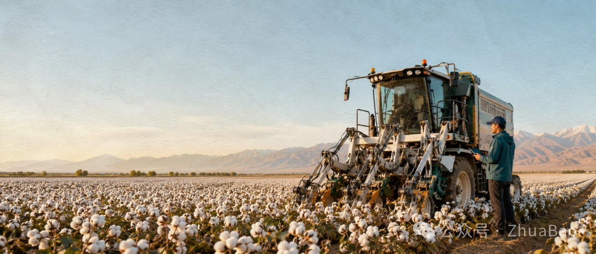
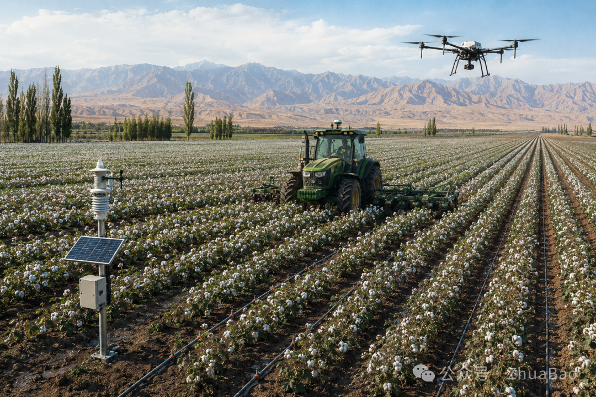
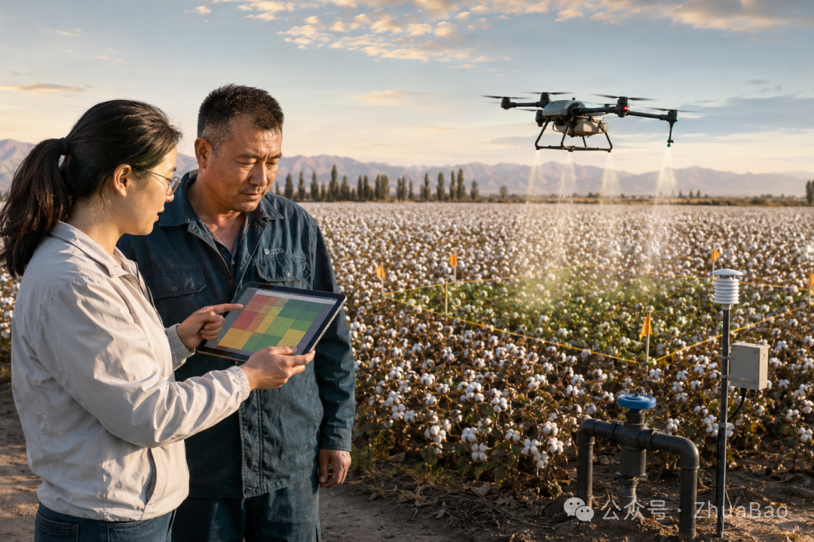

# 一台 108 臂棉花机器人，说明农业 AI 正在跨过哪道坎？

- 作者：ZhuaBao
- 发布时间：2026年8月25日 14:58
- 原文链接：[微信公众号](https://mp.weixin.qq.com/s/3Up0eCP4BQlwt9SmjQv_2A)

从新疆棉田的机器人、无人机和水肥系统，看农业 AI 怎样从识别走向作业

国内智慧农业观察·2026 年 8 月

新疆棉田中的智能农机示意图

今年夏天，新疆石河子的棉田里出现了一台有 108 条机械臂的打顶机器人。

它高 3.8 米，重 8 吨。双目摄像头先找出每株棉花的顶芽，算法确定位置，机械臂随即剪下去。新华社报道显示，这台机器每小时可以处理约 2 公顷棉田，制造商给出的效率是人工的 120 倍，每小时最多完成 30 万次剪切。

一台机器带着 108 条手臂进地，很容易成为农业科技新闻里的主角。可我把近期国内几份智慧农业材料放在一起看，最值得关心的地方并不在手臂数量。摄像头识别出顶芽以后，机器还要走到合适的位置，避开棉株，控制剪切高度，防止伤苗，最后让农户知道这次作业到底做得怎么样。

这是一条完整的农事动作。农业 AI 能否产生价值，就看它能不能把这条动作走完。

## 中国农业 AI 已经站在机械化之上

导航农机、无人机、滴灌和传感器组成可执行的生产系统

谈国内农业 AI，先要看新疆棉花已经走到哪里。

2025 年，新疆棉花产量达到 616.5 万吨，占全国总产量的 92.8%。新疆生产建设兵团的棉花耕种收综合机械化率已经达到 98.86%。导航精量播种、水肥一体化滴灌、无人机植保和机械采收，早已进入棉花生产。

全国的情况也在往前走。2026 年中央一号文件首次写入无人机和机器人应用。当时公布的数据是，国内农用无人机保有量超过 30 万架，年作业面积突破 4.6 亿亩。

这些数字说明，国内农业 AI 有一条很特别的落地路径。农户手里已经有拖拉机、无人机、滴灌阀门和施肥机。AI 接下来的任务，是根据田间变化指挥这些设备，把原本依靠人持续观察和重复操作的环节做得更准。

石河子那台打顶机器人就是一个例子。当地一家经营约 133 公顷棉田的企业告诉新华社，灌溉、施肥、喷药和除草已经不同程度地使用北斗定位和 AI，田间作业由 5 个人管理。报道中的效率、增产和收益数据主要来自制造商与使用企业，目前还不能代表所有棉田。机器至少已经从展示台开进了生产现场。

开进地里以后，难题才会变得具体。

## 一条预警要怎样变成一次作业

从风险识别到人工确认，再到无人机执行与复查

今年 7 月，新疆玛纳斯县一个棉花智慧农场项目公布了采购结果，中标金额 105 万元。采购清单写得很细，系统要建立 8 类模型，预测棉花生物量、冠层含水率、氮磷钾、叶绿素、植被指数和产量，还要监测病虫害与气象环境。

如果项目只做到这里，农户得到的会是一块内容丰富的屏幕。

采购要求又往前走了一步。系统还要接入渠道液位、灌溉蝶阀、闸阀和施肥机，并建立精准灌溉与科学施肥模型。监测发现墒情变化以后，系统给出方案，农户确认，阀门和施肥机执行，新的田间数据再回来检验效果。采购文件给出的交付期是 90 天，验收后的服务期是 3 年。项目目前处在建设阶段，实际节水、节肥和增产效果还要等运行数据。

这份采购清单比很多宏大的行业预测更能说明农业 AI 的方向。模型要认识棉花，还要认识地块、生育期、天气和农户已有的设备。最后发出的指令必须能被一个阀门或一台农机执行。

昌吉今年 3 月启动的棉田水肥一体化项目也在处理相似问题。项目公开提出，要解决棉田数据分散和技术模型适配性差。所谓适配，落到生产里很琐碎。同一种棉花换了土壤、密度和播期，用水节奏就可能变化。一个模型在试验田里表现很好，换到另一片地还得重新校准。

农业不会配合软件保持整齐。风会影响无人机喷洒，泥水会干扰传感器，作物冠层可能削弱导航信号，旧农机也未必能接收新系统的任务。农户面对的是一季收成，错误指令造成的损失很难靠下一次软件更新补回来。

## 农户愿意买的是可核算的结果

农业 AI 产品经常展示识别准确率。这个数字当然有用，但农户很难拿它直接算账。

棉花打顶机器人更容易算。一天能做多少亩，合格率是多少，伤苗多少，需要几个人跟着，租用或购买机器要花多少钱。灌溉系统也一样，一亩地少用了多少水和肥，人工开关阀门的次数减少多少，设备出故障以后多久有人处理。

病虫害预警要算得更细。无人机发现异常区域以后，系统能否判断风险是否达到处理标准，能否生成地块位置、药量和飞行路线。喷完几天后还要重新巡查，确认虫害有没有下降，是否需要补喷。

这些结果都可以在一个种植季里核对。模型准确率提高两个百分点很难单独定价，少跑一遍喷药机、少错过一次防治窗口，却能对应人工、农药、油料和产量。

这也解释了国内已经普及的智能农机为什么常从具体动作切入。自动导航减少重行和漏行，无人机完成植保，滴灌系统控制水肥。它们没有包办整个农场，先把一个频繁发生、结果可查的环节做好。

农业农村部今年征集“人工智能加农业”典型应用场景时，特意提出单点突破、小切口深入应用和可复制推广。这个要求听上去朴素，却很接近农户的采购方式。先证明一项农活值得交给机器，再谈更多环节。

## 国内农业 AI 产品可以从哪里开始

如果现在为规模化棉花种植户做一款产品，第一版可以只处理病虫害巡查与精准喷药。

先确定数据从哪里来。卫星适合看大范围变化，无人机能提供更细的田间图像，地面传感器可以补充气象和墒情。三种数据无需在第一版全部接入，选择一种能够稳定获得的来源就够了。

系统发现异常以后，把地块位置、判断依据和建议动作交给农户或农技人员确认。确认通过，任务再传给现有植保无人机。网络不稳定时，已经下载的地块和航线仍应可用。作业结束，系统保存面积、药量和时间，几天后安排复查。

产品是否有效，也用农事结果衡量。巡田少花了多少时间，农药少用了多少，发现问题到完成喷药缩短了多久，遗漏区域有没有减少。到了季末，再看节省的钱能否覆盖设备、服务和培训费用。

设计这类产品时，还得尽早确定谁付钱。大型农场可能直接采购系统和设备，合作社或农服公司更关心一套设备能服务多少地块，普通种植户可能只在需要喷药时购买一次作业服务。付款者不同，产品要处理的事情也不同。卖给农场，要接好它已有的农机和数据。卖给农服公司，还要安排多块棉田的作业顺序，记录每户用了多少药、飞了多少亩，出了问题能查到当时的任务和操作人。

确认权也要写进流程。系统可以标出疑似病害并建议处理，是否喷药应由农户或农技人员确认。遇到模型没有见过的病斑、恶劣天气或设备异常，系统需要停下来提醒人。农业生产里有不少动作无法轻易撤销，少一次人工确认省不了多少钱，错喷一片地却可能直接伤苗。

国内政策正在给这类产品创造条件。《全国智慧农业行动计划》提出，到 2026 年底，农业生产信息化率达到 30% 以上，形成一批主要作物大面积单产提升方案。新疆随后发布 2026 至 2030 年实施方案，准备汇集气象、水利和自然资源数据，建设病虫害预警等农业模型。

平台和数据会让开发容易一些，农活仍要一项一项接。农户收到一条棉花病虫害预警以后，谁来确认，用哪台无人机，到哪块地里喷多少药，几天后怎样检查结果。

这些问题都有明确答案，AI 才算真正进了棉田。

## 关键来源

新疆棉花打顶机器人生产应用报道

新疆 2025 年棉花生产数据

玛纳斯县棉花智慧农场采购结果

新疆智慧农业实施方案

全国智慧农业行动计划
