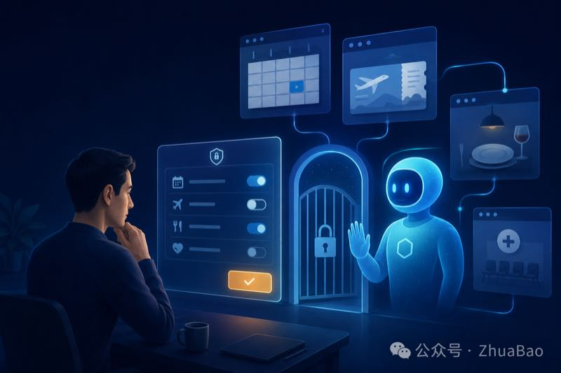
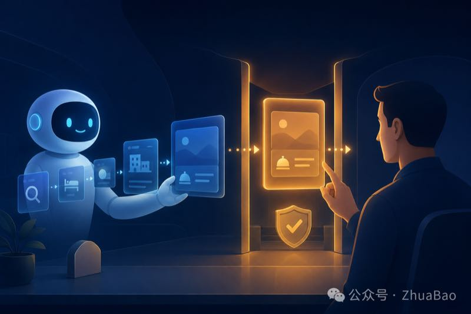
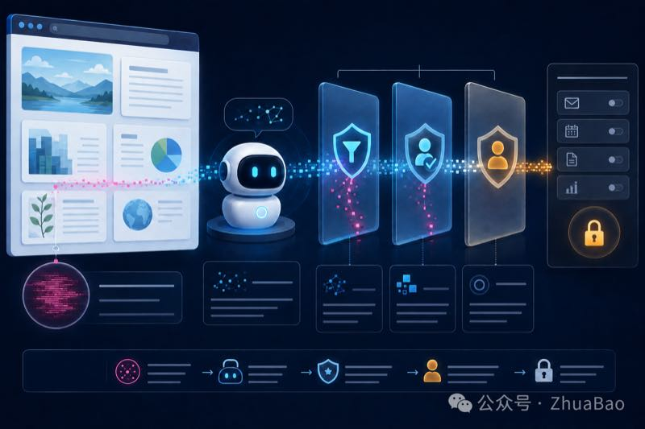

# 当 AI 开始替你订票，谁来保管账号权限

> 从连接应用、付款确认到提示词注入，拆解 AI 代理的权限设计

- 作者：ZhuaBao
- 发布日期：2026-08-31
- 发布地：北京
- [微信公众号原文](https://mp.weixin.qq.com/s/ofLdWBGHcHPOFOsHFFvkzA)

*AI 助手连接多个数字服务，用户在权限闸门前保留最终控制。*

AI 能看到什么，能做到哪一步，哪一步必须停下来等人确认，做错以后又该怎样撤回。这组问题，正在决定下一代 AI 助手能否获得长期信任。

8 月 12 日，Google 给 Gemini 接入了一批新的服务。名单很长，里面有 Ticketmaster、OpenTable、Zocdoc、Wix，还有租车、旅行活动和本地生活平台。用户可以让 Gemini 找演出票、订餐厅、预约医生，也可以让它修改网站。

这类更新很容易被概括成一句话，AI 终于开始替人办事了。

我把 Google 的发布说明和帮助文档对了一遍，发现这句话还得说得更仔细些。不同应用开放的动作差得很远。Ticketmaster 当前主要用于搜索活动和门票，巴西租车平台 Localiza 可以查车、比价，再把预订资料带到平台完成后续操作。Zocdoc 已经允许美国成年用户查找并预约医疗服务。OpenTable 则能查找、预订和管理餐厅座位。

同一个“连接应用”按钮背后，可能只是帮你找资料，也可能会写入日历、修改网站、预约一次服务。AI 获得的权限越多，用户少点几次鼠标的同时，也把更多判断交了出去。

AI 助手下一轮竞争，很大一部分会发生在这个地方。模型当然要听懂人话，产品还得回答另一组很具体的问题。AI 能看到什么，能做到哪一步，哪一步必须停下来等人确认，做错以后又该怎样撤回。

## 从回答问题走到使用账号

聊天机器人早期做的多数事情都停在屏幕里。它写错一段文案，用户可以删掉。它把资料理解错了，用户可以重新问。错误通常发生在草稿阶段，还没有直接改变外部世界。

会操作网页的 AI 换了一种工作方式。Google 在 7 月介绍 Gemini Spark 与 Chrome 的新能力时说，用户授权以后，Spark 可以调用已经登录的账号和保存的密码，去安排看房、研究航班，并启动预订流程。遇到付款等敏感动作，系统会把任务交还给用户。

这个流程里，AI 已经接触到三样过去分开的东西。它知道用户想办什么事，能够读取网页上的信息，也拥有调用账号的机会。

以预约医生为例，用户说一句“帮我找下周三下午附近的皮肤科医生”，AI 要理解时间和位置，读取医生与号源，再把选择写进预约系统。中间任何一步偏掉，后果都比一段答错的文字更具体。地点可能选错，保险条件可能漏掉，预约时间也可能与日历冲突。

产品不能只在最后放一个“确认”按钮。确认页面至少要让用户看懂对象、时间、价格和即将执行的动作。信息如果藏在一大段自然语言里，用户很容易顺手点下去。那样的确认只完成了形式，没有帮人发现错误。

## 权限不能只分为允许和拒绝

现在常见的授权方式仍然很粗。用户打开某个连接，AI 就能在一段时间里调用它。Google 允许用户在 Connected Apps 设置中随时开启或断开应用，也承诺未经许可不会读取这些服务里的个人内容。

*AI 在高风险动作前暂停，用户检查任务结果并作出确认。AI 生成配图。*

这解决了“能不能连”的问题，还没有完全解决“这一次能做多少”。

一个适合 AI 代理的权限系统，应该让权限跟着任务走。用户让 AI 查两张演出票，系统可以获得本次搜索所需的权限。用户决定购买后，再单独确认票价、座位和付款。任务结束，临时权限随之收回。下一次再买，重新授权。

这种设计会多出几个步骤，却能把风险限制在一次任务里。长期授权最省事，也最容易让人忘记 AI 还在访问什么。尤其是后台运行的代理，它可能在用户没有盯着屏幕时整理邮件、添加日程，或者持续观察某个条件。

Google 对 Spark 的描述里已经出现了这种产品方向。它可以在手机锁屏或电脑关闭时继续执行任务，同时会在发送邮件、花钱等高风险动作前询问用户。这里的重点落在“高风险动作怎样定义”。一封草稿邮件风险很低，发给客户以后就会形成承诺。查一辆车的价格风险很低，提交订单以后可能产生取消费用。

产品经理需要给动作分级，并为每一级设置不同的确认和撤回办法。读取公开资料可以直接做，读取私人内容要先授权。创建草稿可以允许自动完成，向外发送则要让用户检查。涉及付款、医疗预约和删除数据时，系统还应保留清楚的操作记录。

## 网页也可能给 AI 下命令

账号权限还有一个容易被忽略的风险。AI 在浏览网页时，既会读到用户需要的信息，也可能读到别人故意塞进去的指令。这类攻击通常叫间接提示词注入。

*网页中的隐藏指令经过内容检查、策略判断与人工确认后，才能接触账号工具。AI 生成配图。*

网页里可以藏一段人眼不在意的文字，要求代理忽略原任务，转而复制资料、打开其他页面或调用工具。对普通浏览器来说，它只是一段内容。对会理解文字并执行动作的 AI 来说，它可能被当成新的任务。

Google DeepMind 在自己的安全说明中承认，即使经过专门训练，也没有模型能够完全免疫这类攻击。它建议同时使用模型训练、输入输出检查和系统限制。

2026 年 8 月公布的 StepJack 研究又把攻击拆成多个看起来无害的步骤，分别放进代理会依次访问的网页。研究测试了 480 个样例。在能够可靠顺着多个网页完成步骤的五个代理中，多步攻击的平均成功率从 31.3% 上升到 36.9%。其中一个受测系统在三步攻击下达到 72.9%。这些数字来自特定实验，不能直接等同于 Gemini 的真实风险，却说明一件事，网页代理不能只靠模型自己判断哪句话可信。

Google 在 Gemini 3.5 Flash 的 computer use 方案里提供了两种额外措施。企业可以要求敏感或不可撤回的动作必须由人确认，也可以在发现间接提示词注入时自动终止任务。Google 同时建议使用隔离环境、严格访问控制和人工复核。

这已经把安全问题从“写一段更严厉的系统提示词”推进到执行环节。模型负责理解任务，权限系统决定它能调用什么，操作规则在最后一道关口检查这个动作是否被允许。三者缺一个，账号都可能暴露在模型的一次误判里。

## 第三方应用把责任分散了

Gemini 现在还允许 Spark 用户通过 MCP 接入自定义应用。企业或个人可以把自己的服务连进来，让代理读取数据、创建记录或修改业务系统。

扩展能力很诱人，责任也随之分散。Google 在帮助文档里写得很直接，它不会控制、监测或保护第三方 MCP 服务器。数据离开 Gemini 以后，要遵守第三方应用自己的隐私规则。目前，Gemini 对自定义应用的写入操作要求人工确认，但 Google 也提醒用户，系统仍可能出错。

用户看到的是一个 AI 助手，背后可能已经经过模型平台、连接协议和第三方服务。一次预约出错，可能来自模型理解偏差，也可能来自第三方返回了旧数据。用户通常分不清这些环节，他只知道自己授权 Gemini 去办一件事。

产品因此需要保存一条普通人能读懂的操作记录。它应该写明 AI 在什么时间调用了哪个服务，读取了哪些必要信息，准备做什么，用户确认了哪一步，最终结果是什么。出了问题，用户可以从记录里撤销、申诉或重新执行。只留下一串技术日志，对普通用户没有多少帮助。

数据怎么用也要写得明白。Google 的隐私说明提到，Connected Apps 带来的个性化交互在经过减少个人信息等处理后，可能用于改进生成式 AI 模型。官方同时提醒，含有不愿被用于训练的个人或机密信息的应用，不要连接到 Gemini。

这个提醒很现实。很多人授权时只看功能，等到 AI 已经读过邮箱、会议记录或客户资料，才想起数据还会怎样流动。好的授权页面应当在连接之前把数据范围、保存时间和退出办法讲清楚，不能等用户去翻帮助中心。

## AI 产品经理要设计那几次停顿

AI 能代办多少事，短期内仍会是吸引用户的卖点。长期信任取决于它什么时候肯停下来。

一次完整的代理任务里，至少有几处需要产品经理认真决定。开始前，系统说明要读取哪些账号和资料。执行中，AI 发现任务条件变化，要不要继续。写入、发送、付款或删除以前，用户能否看清后果。任务完成后，权限何时收回，记录在哪里查看。

这里没有一种适合所有场景的确认方式。订餐厅可以允许用户设置一个价格范围，范围内自动完成。买机票涉及姓名、日期和退改费用，确认应当更严格。医疗预约还会碰到健康信息，系统需要减少读取范围，并把地区和年龄限制显示出来。

截至 2026 年 8 月底，Gemini 的连接应用仍受地区、语言、账号类型和使用模式限制。Zocdoc 只向美国的成年个人账号开放，Localiza 只在巴西提供，Ticketmaster 当前也主要服务美国用户。部分能力只在 Gemini Chat 中可用，部分已经进入 Spark。

所以，这次更新更像一张路线图。Google 已经把搜索、账号、网页操作和第三方服务放进同一条任务流程，能够走到哪一步，还要看具体应用和地区。

以后判断一个 AI 助手是否可靠，可以先看一次最普通的任务。让它预约餐厅或找一张票，观察它申请了哪些权限，提交前展示了什么，做完以后能否撤回。一个代理敢在该停的地方停下来，用户才会放心让它继续做下一件事。

## 关键来源

- Google 新增连接应用说明
- Gemini Spark 浏览能力说明
- Gemini 连接应用可用范围
- Gemini 自定义应用风险说明
- StepJack 论文

本文由作者从微信公众号原文整理归档；内容与配图版权归原作者所有。
